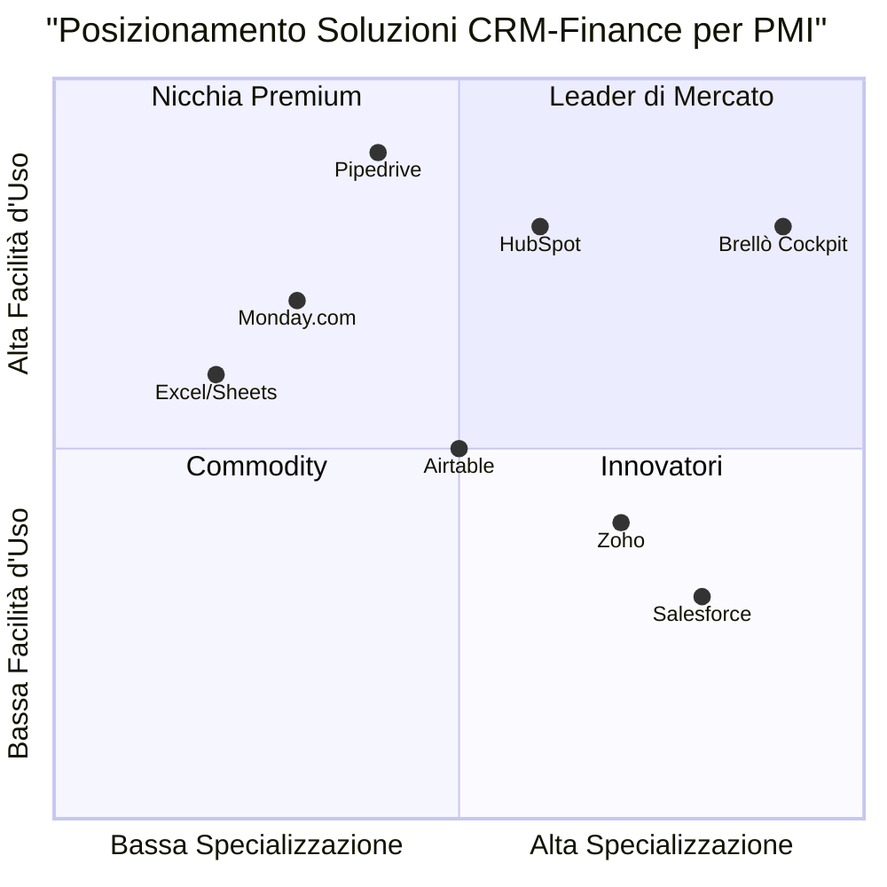

# PRD - Brellò Sales & Finance Cockpit

## 1. Informazioni di Progetto

**Linguaggio:** Italiano  
**Linguaggio di Programmazione:** Shadcn-ui, TypeScript, Tailwind CSS  
**Nome Progetto:** brello_sales_finance_cockpit  

### Requisiti Originali
Sviluppare un'applicazione web interna (desktop + mobile) per Brellò - Umbrella Sharing che permetta di:
- Tracciare pipeline vendite per lotto (trimestre) e per tipologia di spazio
- Calcolare margine e margine % su ogni proposta/contratto con un preventivatore
- Proiettare ricavi, costi, cassa e KPI con scenari (Base/Best/Worst) e sensitività
- Controllare soglia di pre-vendita per il go/no-go stampa lotto (target: ≥70% spazi venduti)
- Gestire variabili finanziarie (costi fissi/variabili, cash-in/out, working capital)

## 2. Definizione del Prodotto

### 2.1 Obiettivi del Prodotto

1. **Ottimizzazione delle Vendite**: Massimizzare l'occupancy degli spazi ombrello attraverso un sistema di tracking efficace della pipeline vendite e gestione automatizzata delle opportunità commerciali.

2. **Controllo Finanziario Avanzato**: Fornire visibilità completa su margini, costi e proiezioni di cassa per supportare decisioni strategiche basate su dati in tempo reale.

3. **Automazione dei Processi Decisionali**: Implementare un sistema go/no-go automatizzato per la stampa dei lotti basato su soglie di pre-vendita predefinite, riducendo i rischi operativi.

### 2.2 User Stories

**US1 - Sales Manager**  
Come Sales Manager, voglio visualizzare la pipeline vendite per lotto in una vista Kanban drag&drop, così da poter gestire efficacemente le opportunità e monitorare i tassi di conversione per segmento cliente.

**US2 - Finance Manager**  
Come Finance Manager, voglio utilizzare il preventivatore per calcolare margini in tempo reale su ogni proposta, così da poter ottimizzare la redditività e prendere decisioni di pricing informate.

**US3 - Operations Manager**  
Come Operations Manager, voglio monitorare la soglia go/no-go per la stampa lotto attraverso un sistema di alert automatici, così da evitare investimenti su lotti non profittevoli.

**US4 - Business Analyst**  
Come Business Analyst, voglio utilizzare lo Scenario Planner per simulare diversi scenari di occupancy e pricing, così da supportare la pianificazione strategica con proiezioni accurate.

**US5 - CEO/Founder**  
Come CEO, voglio accedere a una dashboard esecutiva con KPI chiave e break-even analysis, così da monitorare la performance complessiva del business e identificare opportunità di crescita.

### 2.3 Analisi Competitiva

**1. Salesforce Sales Cloud**
- *Pro*: CRM completo, automazioni avanzate, reporting robusto
- *Contro*: Costo elevato, complessità eccessiva per PMI, non specifico per modelli di condivisione

**2. HubSpot CRM**
- *Pro*: Interfaccia user-friendly, pipeline management, integrazione marketing
- *Contro*: Limitazioni nel calcolo margini complessi, mancanza di scenario planning finanziario

**3. Pipedrive**
- *Pro*: Focus su pipeline vendite, semplicità d'uso, mobile-friendly
- *Contro*: Funzionalità finanziarie limitate, mancanza di gestione inventario spazi

**4. Zoho CRM + Books**
- *Pro*: Suite integrata CRM-Finance, pricing competitivo
- *Contro*: Interfaccia datata, personalizzazione limitata per business model specifici

**5. Monday.com**
- *Pro*: Flessibilità, automazioni, dashboard personalizzabili
- *Contro*: Non specifico per vendite, mancanza di calcoli finanziari avanzati

**6. Airtable + Zapier**
- *Pro*: Personalizzazione massima, integrazioni, costo contenuto
- *Contro*: Richiede setup complesso, mancanza di funzionalità native per scenario planning

**7. Custom Excel/Google Sheets**
- *Pro*: Controllo totale, costo zero, familiarità utenti
- *Contro*: Mancanza di automazioni, errori manuali, scalabilità limitata

### 2.4 Quadrante Competitivo



## 3. Specifiche Tecniche

### 3.1 Analisi dei Requisiti

L'applicazione Brellò Sales & Finance Cockpit deve supportare un modello di business innovativo basato sulla condivisione di ombrelli, con caratteristiche uniche:

- **Gestione Inventario Spaziale**: 18 spazi ombrello per lotto (8 interni + 8 esterni + 2 centrali) + 10 stazioni sponsorizzabili
- **Cicli Trimestrali**: 3 lotti/anno con logica di pre-vendita e soglie go/no-go
- **Pricing Differenziato**: Standard €900, Plus €1.100, Premium €1.500 per lotto + Sponsorship €300/mese
- **Marginalità Critica**: Target margine operativo annuo ~€11.7k su ricavi base €57.900

### 3.2 Pool dei Requisiti

#### Requisiti P0 (Must-Have)

**R001 - Gestione Lotti e Inventario**  
Il sistema DEVE permettere la creazione e gestione di lotti trimestrali con inventario fisso di 18 spazi ombrello e 10 stazioni sponsorizzabili.

**R002 - Pipeline Vendite Kanban**  
Il sistema DEVE fornire una vista Kanban per la gestione delle opportunità con fasi: Lead → Qualifica → Offerta → Chiusura.

**R003 - Preventivatore con Margini**  
Il sistema DEVE calcolare margini in tempo reale considerando: prezzo listino, sconti, costi allocati per slot, margine unitario e totale.

**R004 - Sistema Go/No-Go**  
Il sistema DEVE implementare controllo automatico soglia 70% occupancy spazi + alert T-14 giorni con blocco stampa se soglia non raggiunta.

**R005 - Dashboard KPI**  
Il sistema DEVE mostrare: occupancy spazi/stazioni %, ricavo vs target, margine YTD, break-even gauge, cash runway.

**R006 - Gestione Costi e Cassa**  
Il sistema DEVE tracciare costi annui (€46.200 base) allocati su 3 lotti + movimenti cassa previsti vs effettivi.

#### Requisiti P1 (Should-Have)

**R007 - Scenario Planner**  
Il sistema DOVREBBE permettere simulazioni con slider: occupancy (50-100%), prezzi (±20%), costi (±15%) con output comparativo.

**R008 - Automazioni CRM**  
Il sistema DOVREBBE automatizzare: solleciti incassi (T-7), rinnovi clienti (T-45), alert performance.

**R009 - Segmentazione Clienti**  
Il sistema DOVREBBE categorizzare clienti: PMI locale/regionale/nazionale/istituzionale con KPI specifici.

**R010 - Report e Export**  
Il sistema DOVREBBE generare report per cliente/segmento con export CSV/PDF e stampa offerte.

#### Requisiti P2 (Nice-to-Have)

**R011 - Mobile Responsive**  
Il sistema PUÒ essere ottimizzato per dispositivi mobile con funzionalità core accessibili.

**R012 - Integrazioni Esterne**  
Il sistema PUÒ integrare import business plan XLS/CSV e webhook QR scans per engagement tracking.

**R013 - Multi-Città**  
Il sistema PUÒ supportare espansione multi-città con dashboard aggregate.

### 3.3 Bozza Design UI

#### Layout Principale
```
┌─────────────────────────────────────────────────────────────┐
│ BRELLÒ COCKPIT                    [User] [Settings] [Help] │
├─────────────────────────────────────────────────────────────┤
│ [Dashboard] [Pipeline] [Preventivatore] [Lotti] [Cassa]    │
│ [Scenari] [Report]                                         │
├─────────────────────────────────────────────────────────────┤
│                                                             │
│  ┌─────────────┐ ┌─────────────┐ ┌─────────────┐          │
│  │ LOTTO       │ │ OCCUPANCY   │ │ MARGINE YTD │          │
│  │ 2025-Q4-AL  │ │ 🟢 78%      │ │ €8.2k/€11.7k│          │
│  │ €19.3k tgt  │ │ Spazi: 14/18│ │ Break-even   │          │
│  │ ⏰ 45 giorni │ │ Staz: 7/10  │ │ [████░░] 70% │          │
│  └─────────────┘ └─────────────┘ └─────────────┘          │
│                                                             │
│  FUNNEL VENDITE                    CASH RUNWAY             │
│  Lead(12) → Qualif(8) → Offerta(5) → Chiusi(3)           │
│  Tasso conversione: 25%            📊 Grafico 6 mesi      │
│                                                             │
└─────────────────────────────────────────────────────────────┘
```

#### Pipeline Kanban
```
┌─────────────────────────────────────────────────────────────┐
│ PIPELINE VENDITE - Lotto 2025-Q4-AL                       │
├─────────────────────────────────────────────────────────────┤
│ LEAD      │ QUALIFICA │ OFFERTA   │ CHIUSURA  │ VINTO     │
│ (12)      │ (8)       │ (5)       │ (3)       │ (14)      │
├───────────┼───────────┼───────────┼───────────┼───────────┤
│ 🏢 Azienda│ 🏪 Bar    │ 💼 Studio │ ✅ Hotel  │ ✅ Rist.  │
│ A Plus    │ B Standard│ C Premium │ D Plus    │ E Standard│
│ €1.100    │ €900      │ €1.500    │ €1.100    │ €900      │
│ 60% prob  │ 70% prob  │ 80% prob  │ 90% prob  │ 100%      │
│           │           │           │           │           │
│ [+ Nuovo] │ [Drag&Drop Support]   │           │ TOTALE:   │
│           │                       │           │ €16.8k    │
└───────────┴───────────┴───────────┴───────────┴───────────┘
```

#### Preventivatore
```
┌─────────────────────────────────────────────────────────────┐
│ PREVENTIVATORE - Nuova Offerta                             │
├─────────────────────────────────────────────────────────────┤
│ Cliente: [Dropdown] Nuovo: [+ Aggiungi]                   │
│ Lotto: [2025-Q4-AL ▼]                                     │
│                                                             │
│ SPAZI OMBRELLO:                                            │
│ ☑ Standard (€900) Qty: [2] Sconto: [5%] = €1.710         │
│ ☑ Plus (€1.100)   Qty: [1] Sconto: [0%] = €1.100         │
│ ☐ Premium (€1.500) Qty: [0] Sconto: [0%] = €0            │
│                                                             │
│ SPONSORSHIP STAZIONI:                                      │
│ ☑ Stazione (€900)  Qty: [1] Sconto: [10%] = €810         │
│                                                             │
│ ┌─────────────────────────────────────────────────────────┐ │
│ │ RIEPILOGO MARGINI                                       │ │
│ │ Ricavo Totale: €3.620                                   │ │
│ │ Costo Allocato: €2.567 (€142.6/slot × 18)              │ │
│ │ Margine Lordo: €1.053                                   │ │
│ │ Margine %: 29.1%                                        │ │
│ │ [🟢 MARGINE POSITIVO]                                   │ │
│ └─────────────────────────────────────────────────────────┘ │
│                                                             │
│ [Salva Bozza] [Genera PDF] [Invia Offerta]                │
└─────────────────────────────────────────────────────────────┘
```

### 3.4 Domande Aperte

1. **Integrazione Pagamenti**: È necessario integrare gateway di pagamento per incassi automatici o la gestione rimane manuale?

2. **Multi-Utente Concorrente**: Quanti utenti simultanei sono previsti e serve gestione conflitti su modifiche concurrent?

3. **Backup e Disaster Recovery**: Quali sono i requisiti di backup dei dati e recovery time objective?

4. **Compliance GDPR**: Serve implementazione specifica per gestione privacy dati clienti e consensi?

5. **Scalabilità Geografica**: L'architettura deve supportare da subito multi-città o può essere single-tenant?

6. **Integrazione Contabilità**: È richiesta sincronizzazione con software contabili esistenti (Fatture in Cloud, Aruba, etc.)?

7. **Notifiche**: Le notifiche devono essere solo in-app o serve supporto email/SMS per alert critici?

8. **Audit Trail**: È necessario tracciamento completo delle modifiche per compliance o controllo interno?

## 4. Modello Dati Dettagliato

### 4.1 Entità Principali

#### Cliente
```typescript
interface Cliente {
  id: string;
  ragione_sociale: string;
  piva_codfisc: string;
  categoria: 'PMI_LOCALE' | 'PMI_REGIONALE' | 'PMI_NAZIONALE' | 'ISTITUZIONALE';
  contatti: {
    email: string;
    telefono: string;
    indirizzo: string;
    referente: string;
  };
  note: string;
  created_at: Date;
  updated_at: Date;
}
```

#### Lotto
```typescript
interface Lotto {
  id: string;
  codice_lotto: string; // es. "2025-Q4-AL"
  citta: string;
  periodo_start: Date;
  periodo_end: Date;
  inventario_spazi: number; // default 18
  stazioni_tot: number; // default 10
  stato: 'PREVENDITA' | 'ATTIVO' | 'CHIUSO';
  soglia_go_nogo: number; // default 70%
  target_ricavo: number; // default €19.300
  created_at: Date;
  updated_at: Date;
}
```

#### Spazio
```typescript
interface Spazio {
  id: string;
  lotto_id: string;
  tipo: 'STANDARD' | 'PLUS' | 'PREMIUM';
  prezzo_listino: number;
  sconto_perc: number;
  prezzo_netto: number;
  stato: 'LIBERO' | 'OPZIONATO' | 'VENDUTO' | 'INVENDUTO';
  cliente_id?: string;
  contratto_id?: string;
  created_at: Date;
  updated_at: Date;
}
```

#### SponsorshipStazione
```typescript
interface SponsorshipStazione {
  id: string;
  lotto_id: string;
  numero_stazione: number;
  prezzo_listino_lotto: number; // default €900
  sconto_perc: number;
  prezzo_netto: number;
  stato: 'LIBERA' | 'OPZIONATA' | 'VENDUTA';
  cliente_id?: string;
  contratto_id?: string;
  created_at: Date;
  updated_at: Date;
}
```

#### Opportunità
```typescript
interface Opportunita {
  id: string;
  cliente_id: string;
  lotto_id: string;
  oggetto: string;
  tipo: 'SPAZIO' | 'STAZIONE' | 'MISTO';
  valore_previsto: number;
  fase: 'LEAD' | 'QUALIFICA' | 'OFFERTA' | 'CHIUSURA';
  probabilita_perc: number;
  data_chiusura_prevista: Date;
  note: string;
  created_at: Date;
  updated_at: Date;
}
```

#### Contratto
```typescript
interface Contratto {
  id: string;
  cliente_id: string;
  lotto_id: string;
  numero_contratto: string;
  righe: ContrattoRiga[];
  ricavo_totale: number;
  termini_pagamento: string;
  date_incasso_previste: Date[];
  stato: 'BOZZA' | 'INVIATO' | 'FIRMATO' | 'INCASSATO';
  created_at: Date;
  updated_at: Date;
}

interface ContrattoRiga {
  tipo: 'SPAZIO' | 'STAZIONE';
  spazio_id?: string;
  stazione_id?: string;
  quantita: number;
  prezzo_unitario: number;
  sconto_perc: number;
  totale_riga: number;
}
```

#### CostItem
```typescript
interface CostItem {
  id: string;
  lotto_id?: string; // null per costi annui
  categoria: 'PERSONALE' | 'VEICOLO' | 'OMBRELLI' | 'STAZIONI' | 'MARKETING' | 'PERMESSI' | 'PERDITE' | 'ALTRO';
  descrizione: string;
  importo: number;
  cadenza: 'UNA_TANTUM' | 'MENSILE' | 'LOTTO' | 'ANNUALE';
  data_competenza: Date;
  created_at: Date;
  updated_at: Date;
}
```

#### MovimentoCassa
```typescript
interface MovimentoCassa {
  id: string;
  data: Date;
  tipo: 'INCASSO' | 'PAGAMENTO';
  importo: number;
  cliente_fornitore: string;
  riferimento_contratto_id?: string;
  riferimento_costo_id?: string;
  stato: 'PREVISTO' | 'INCASSATO' | 'PAGATO';
  note: string;
  created_at: Date;
  updated_at: Date;
}
```

#### KPISnapshot
```typescript
interface KPISnapshot {
  id: string;
  lotto_id: string;
  data_snapshot: Date;
  occupancy_spazi_perc: number;
  occupancy_stazioni_perc: number;
  ricavo_lotto: number;
  costo_lotto: number;
  margine_lotto: number;
  margine_perc: number;
  lead_to_close_perc: number;
  cac_per_segmento: Record<string, number>;
  created_at: Date;
}
```

### 4.2 Calcoli e Formule Business

#### Ricavo Lotto
```typescript
function calcolaRicavoLotto(lotto_id: string): number {
  const spazi_venduti = getSpazi(lotto_id, 'VENDUTO');
  const stazioni_vendute = getStazioni(lotto_id, 'VENDUTA');
  
  const ricavo_spazi = spazi_venduti.reduce((sum, spazio) => sum + spazio.prezzo_netto, 0);
  const ricavo_stazioni = stazioni_vendute.reduce((sum, stazione) => sum + stazione.prezzo_netto, 0);
  
  return ricavo_spazi + ricavo_stazioni;
}
```

#### Occupancy Percentuali
```typescript
function calcolaOccupancy(lotto_id: string): {spazi: number, stazioni: number} {
  const lotto = getLotto(lotto_id);
  const spazi_venduti = countSpazi(lotto_id, 'VENDUTO');
  const stazioni_vendute = countStazioni(lotto_id, 'VENDUTA');
  
  return {
    spazi: (spazi_venduti / lotto.inventario_spazi) * 100,
    stazioni: (stazioni_vendute / lotto.stazioni_tot) * 100
  };
}
```

#### Margine Lotto
```typescript
function calcolaMargine(lotto_id: string): {margine: number, margine_perc: number} {
  const ricavo = calcolaRicavoLotto(lotto_id);
  const costo = calcolaCostoLotto(lotto_id);
  const margine = ricavo - costo;
  
  return {
    margine: margine,
    margine_perc: ricavo > 0 ? (margine / ricavo) * 100 : 0
  };
}
```

#### Costo Lotto Allocato
```typescript
function calcolaCostoLotto(lotto_id: string): number {
  const costi_annui = getCostiAnnui();
  const costo_allocato_base = costi_annui / 3; // 3 lotti/anno
  const costi_specifici = getCostiSpecificiLotto(lotto_id);
  
  return costo_allocato_base + costi_specifici;
}
```

#### Break-Even Analysis
```typescript
function calcolaBreakEven(): {annuo: number, lotto: number, mesi_copertura: number} {
  const costi_annui = 46200; // €46.2k base
  const ricavo_medio_lotto = 19300; // €19.3k target
  
  return {
    annuo: costi_annui,
    lotto: costi_annui / 3,
    mesi_copertura: calcolaCashRunway()
  };
}
```

### 4.3 Sistema Go/No-Go

```typescript
interface GoNoGoStatus {
  lotto_id: string;
  occupancy_attuale: number;
  soglia_richiesta: number;
  giorni_rimanenti: number;
  status: 'GO' | 'WARNING' | 'NO_GO';
  blocco_stampa: boolean;
  alert_inviato: boolean;
}

function verificaGoNoGo(lotto_id: string): GoNoGoStatus {
  const lotto = getLotto(lotto_id);
  const occupancy = calcolaOccupancy(lotto_id);
  const giorni_rimanenti = calcolaGiorniRimanenti(lotto.periodo_start);
  
  let status: 'GO' | 'WARNING' | 'NO_GO' = 'GO';
  let blocco_stampa = false;
  
  if (occupancy.spazi < lotto.soglia_go_nogo) {
    if (giorni_rimanenti <= 14) {
      status = 'NO_GO';
      blocco_stampa = true;
    } else if (giorni_rimanenti <= 30) {
      status = 'WARNING';
    }
  }
  
  return {
    lotto_id,
    occupancy_attuale: occupancy.spazi,
    soglia_richiesta: lotto.soglia_go_nogo,
    giorni_rimanenti,
    status,
    blocco_stampa,
    alert_inviato: checkAlertInviato(lotto_id)
  };
}
```

## 5. Architettura Tecnica

### 5.1 Stack Tecnologico

**Frontend:**
- React 18 + TypeScript
- Shadcn/ui + Tailwind CSS
- React Query per state management
- React Hook Form per form handling
- Recharts per grafici e dashboard
- React DnD per Kanban drag&drop

**Backend:**
- Node.js + Express + TypeScript
- PostgreSQL per database principale
- Redis per caching e sessioni
- JWT per autenticazione
- Nodemailer per email notifications

**Deployment:**
- Docker containers
- Nginx reverse proxy
- PM2 per process management
- PostgreSQL backup automatico

### 5.2 Struttura Database

```sql
-- Tabelle principali con relazioni
CREATE TABLE clienti (
  id UUID PRIMARY KEY DEFAULT gen_random_uuid(),
  ragione_sociale VARCHAR(255) NOT NULL,
  piva_codfisc VARCHAR(50) UNIQUE NOT NULL,
  categoria VARCHAR(50) NOT NULL,
  contatti JSONB NOT NULL,
  note TEXT,
  created_at TIMESTAMP DEFAULT NOW(),
  updated_at TIMESTAMP DEFAULT NOW()
);

CREATE TABLE lotti (
  id UUID PRIMARY KEY DEFAULT gen_random_uuid(),
  codice_lotto VARCHAR(50) UNIQUE NOT NULL,
  citta VARCHAR(100) NOT NULL,
  periodo_start DATE NOT NULL,
  periodo_end DATE NOT NULL,
  inventario_spazi INTEGER DEFAULT 18,
  stazioni_tot INTEGER DEFAULT 10,
  stato VARCHAR(20) DEFAULT 'PREVENDITA',
  soglia_go_nogo DECIMAL(5,2) DEFAULT 70.00,
  target_ricavo DECIMAL(10,2) DEFAULT 19300.00,
  created_at TIMESTAMP DEFAULT NOW(),
  updated_at TIMESTAMP DEFAULT NOW()
);

-- Indici per performance
CREATE INDEX idx_clienti_categoria ON clienti(categoria);
CREATE INDEX idx_lotti_stato ON lotti(stato);
CREATE INDEX idx_lotti_periodo ON lotti(periodo_start, periodo_end);
```

### 5.3 API Endpoints

```typescript
// REST API structure
/api/v1/
├── auth/
│   ├── POST /login
│   ├── POST /logout
│   └── GET /me
├── clienti/
│   ├── GET /clienti
│   ├── POST /clienti
│   ├── GET /clienti/:id
│   ├── PUT /clienti/:id
│   └── DELETE /clienti/:id
├── lotti/
│   ├── GET /lotti
│   ├── POST /lotti
│   ├── GET /lotti/:id
│   ├── PUT /lotti/:id
│   ├── GET /lotti/:id/spazi
│   ├── GET /lotti/:id/stazioni
│   └── GET /lotti/:id/go-nogo-status
├── opportunita/
│   ├── GET /opportunita
│   ├── POST /opportunita
│   ├── PUT /opportunita/:id
│   ├── DELETE /opportunita/:id
│   └── PUT /opportunita/:id/fase
├── contratti/
│   ├── GET /contratti
│   ├── POST /contratti
│   ├── GET /contratti/:id
│   ├── PUT /contratti/:id
│   └── GET /contratti/:id/pdf
├── preventivatore/
│   ├── POST /preventivatore/calcola
│   └── POST /preventivatore/genera-pdf
├── costi/
│   ├── GET /costi
│   ├── POST /costi
│   ├── PUT /costi/:id
│   └── DELETE /costi/:id
├── cassa/
│   ├── GET /movimenti
│   ├── POST /movimenti
│   ├── PUT /movimenti/:id
│   └── GET /saldo-mensile
├── kpi/
│   ├── GET /dashboard
│   ├── GET /lotto/:id/kpi
│   └── GET /trend-annuali
├── scenari/
│   ├── POST /simula
│   ├── GET /scenari-salvati
│   └── POST /scenari-salvati
└── report/
    ├── GET /vendite-per-segmento
    ├── GET /performance-lotti
    └── POST /export-csv
```

## 6. Specifiche UI/UX

### 6.1 Design System

**Colori Primari:**
- Primary: #0066CC (Blu Brellò)
- Success: #10B981 (Verde per GO)
- Warning: #F59E0B (Giallo per WARNING)
- Error: #EF4444 (Rosso per NO-GO)
- Gray: #6B7280 (Testi secondari)

**Tipografia:**
- Heading: Inter Bold
- Body: Inter Regular
- Monospace: JetBrains Mono (per numeri/KPI)

**Componenti Chiave:**
- Card con shadow per KPI
- Badge colorati per stati
- Progress bar per occupancy
- Gauge chart per break-even
- Semaforo per go/no-go status

### 6.2 Responsive Breakpoints

```css
/* Mobile First Approach */
@media (min-width: 640px) { /* sm */ }
@media (min-width: 768px) { /* md */ }
@media (min-width: 1024px) { /* lg */ }
@media (min-width: 1280px) { /* xl */ }
```

**Mobile (< 768px):**
- Stack verticale per dashboard cards
- Kanban orizzontale scrollabile
- Form a schermo intero
- Menu hamburger

**Tablet (768px - 1024px):**
- Grid 2x2 per dashboard
- Kanban con 3 colonne visibili
- Sidebar collassabile

**Desktop (> 1024px):**
- Layout completo con sidebar
- Kanban 5 colonne
- Modali centrate
- Tooltips avanzati

### 6.3 Accessibilità

- WCAG 2.1 AA compliance
- Contrasto colori 4.5:1 minimo
- Navigazione da tastiera
- Screen reader support
- Focus indicators visibili
- Alt text per grafici

## 7. Sicurezza e Compliance

### 7.1 Autenticazione e Autorizzazione

**Ruoli Sistema:**
```typescript
enum UserRole {
  ADMIN = 'admin',      // Accesso completo
  SALES = 'sales',      // Clienti, pipeline, preventivi
  FINANCE = 'finance',  // Costi, cassa, scenari, report
  VIEWER = 'viewer'     // Solo lettura dashboard/report
}

interface Permission {
  resource: string;
  actions: ('create' | 'read' | 'update' | 'delete')[];
}

const ROLE_PERMISSIONS: Record<UserRole, Permission[]> = {
  [UserRole.ADMIN]: [
    { resource: '*', actions: ['create', 'read', 'update', 'delete'] }
  ],
  [UserRole.SALES]: [
    { resource: 'clienti', actions: ['create', 'read', 'update'] },
    { resource: 'opportunita', actions: ['create', 'read', 'update', 'delete'] },
    { resource: 'contratti', actions: ['create', 'read', 'update'] },
    { resource: 'preventivatore', actions: ['create', 'read'] }
  ],
  [UserRole.FINANCE]: [
    { resource: 'costi', actions: ['create', 'read', 'update', 'delete'] },
    { resource: 'cassa', actions: ['create', 'read', 'update'] },
    { resource: 'scenari', actions: ['create', 'read'] },
    { resource: 'report', actions: ['read'] }
  ],
  [UserRole.VIEWER]: [
    { resource: 'dashboard', actions: ['read'] },
    { resource: 'report', actions: ['read'] }
  ]
};
```

### 7.2 Sicurezza Dati

**Crittografia:**
- HTTPS obbligatorio (TLS 1.3)
- JWT con refresh token
- Password hash con bcrypt (cost 12)
- Dati sensibili encrypted at rest

**Validazione Input:**
- Joi schema validation
- SQL injection prevention
- XSS protection
- CSRF tokens
- Rate limiting API

**Audit Trail:**
```typescript
interface AuditLog {
  id: string;
  user_id: string;
  action: string;
  resource: string;
  resource_id: string;
  old_values?: any;
  new_values?: any;
  ip_address: string;
  user_agent: string;
  timestamp: Date;
}
```

### 7.3 GDPR Compliance

**Dati Personali Gestiti:**
- Ragione sociale clienti
- Contatti (email, telefono)
- Note commerciali

**Misure Implementate:**
- Consenso esplicito raccolta dati
- Right to be forgotten (cancellazione cliente)
- Data portability (export CSV)
- Privacy by design
- Data retention policy (7 anni)

## 8. Testing e Quality Assurance

### 8.1 Strategia di Test

**Unit Tests (Jest + React Testing Library):**
- Componenti UI isolati
- Funzioni di calcolo business
- Utility functions
- API endpoints

**Integration Tests:**
- Flussi completi utente
- Database operations
- API integration
- Email notifications

**E2E Tests (Playwright):**
- Scenari critici business
- Cross-browser compatibility
- Mobile responsiveness
- Performance benchmarks

### 8.2 Metriche Qualità

**Code Coverage:** > 80%
**Performance:**
- Time to Interactive < 3s
- Largest Contentful Paint < 2.5s
- Cumulative Layout Shift < 0.1

**Accessibility:** WCAG 2.1 AA
**Security:** OWASP Top 10 compliance

## 9. Deployment e DevOps

### 9.1 Pipeline CI/CD

```yaml
# GitHub Actions workflow
name: Deploy Brellò Cockpit

on:
  push:
    branches: [main, staging]

jobs:
  test:
    runs-on: ubuntu-latest
    steps:
      - uses: actions/checkout@v3
      - uses: actions/setup-node@v3
      - run: npm ci
      - run: npm run test:coverage
      - run: npm run lint
      - run: npm run type-check

  build:
    needs: test
    runs-on: ubuntu-latest
    steps:
      - uses: actions/checkout@v3
      - run: docker build -t brello-cockpit .
      - run: docker push ${{ secrets.REGISTRY_URL }}/brello-cockpit

  deploy:
    needs: build
    runs-on: ubuntu-latest
    steps:
      - run: kubectl apply -f k8s/
      - run: kubectl rollout status deployment/brello-cockpit
```

### 9.2 Monitoring e Logging

**Application Monitoring:**
- Winston per logging strutturato
- Prometheus metrics
- Grafana dashboards
- Sentry error tracking

**Business Metrics:**
- Daily active users
- Conversion rates per funnel
- Average deal size
- Time to close opportunities

**Alerts:**
- System downtime
- High error rates
- Failed go/no-go checks
- Payment delays

## 10. Roadmap e Evoluzioni Future

### 10.1 Fase 1 - MVP (3 mesi)
- ✅ Gestione base lotti e clienti
- ✅ Pipeline Kanban semplice
- ✅ Preventivatore con margini
- ✅ Dashboard KPI essenziali
- ✅ Sistema go/no-go

### 10.2 Fase 2 - Enhancement (2 mesi)
- 📋 Scenario Planner completo
- 📋 Automazioni CRM avanzate
- 📋 Report e export
- 📋 Mobile optimization
- 📋 Integrazione email

### 10.3 Fase 3 - Scale (3 mesi)
- 🔮 Multi-città support
- 🔮 Advanced analytics
- 🔮 API integrations
- 🔮 Mobile app nativa
- 🔮 AI-powered forecasting

### 10.4 Metriche di Successo

**Adozione:**
- 100% team utilizza sistema entro 30 giorni
- Riduzione 50% tempo gestione pipeline
- Incremento 25% tasso conversione lead

**Business Impact:**
- Raggiungimento 75% occupancy media
- Riduzione 30% lotti sotto soglia go/no-go
- Miglioramento 20% margine medio per lotto

**Efficienza Operativa:**
- Automazione 80% task ripetitivi
- Riduzione 60% errori manuali calcoli
- Time-to-insight < 5 minuti per KPI

---

*Documento PRD v1.0 - Brellò Sales & Finance Cockpit*  
*Data: 30 Settembre 2025*  
*Preparato da: Emma, Product Manager*